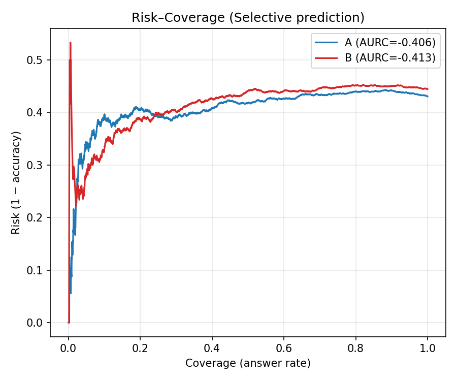
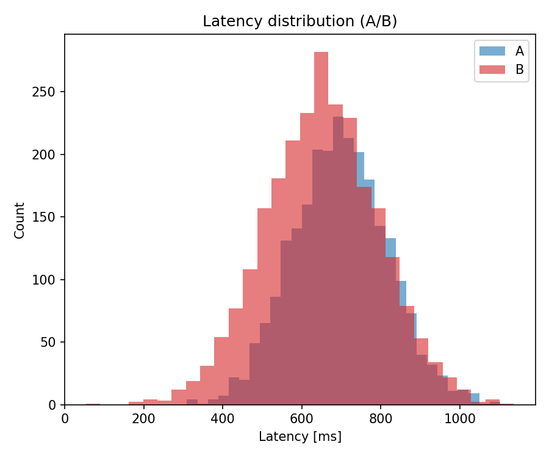
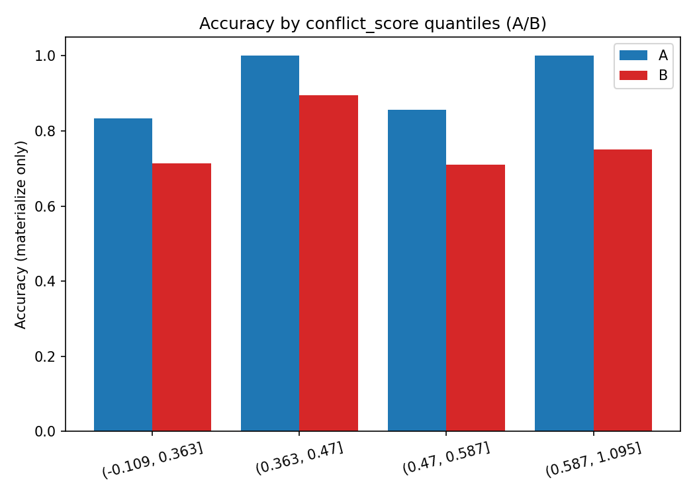
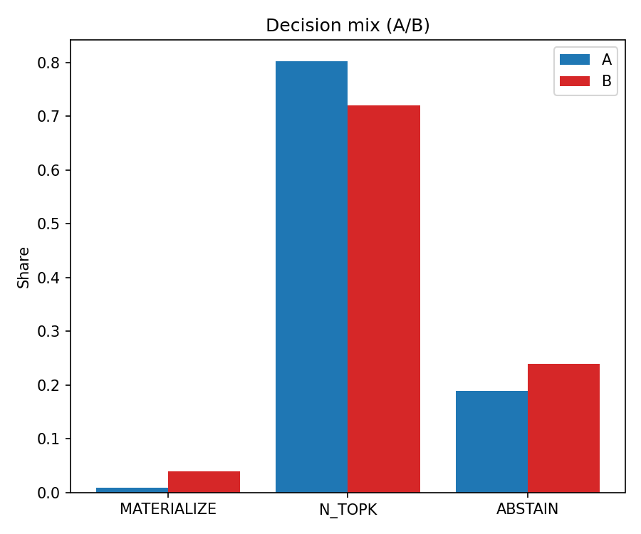
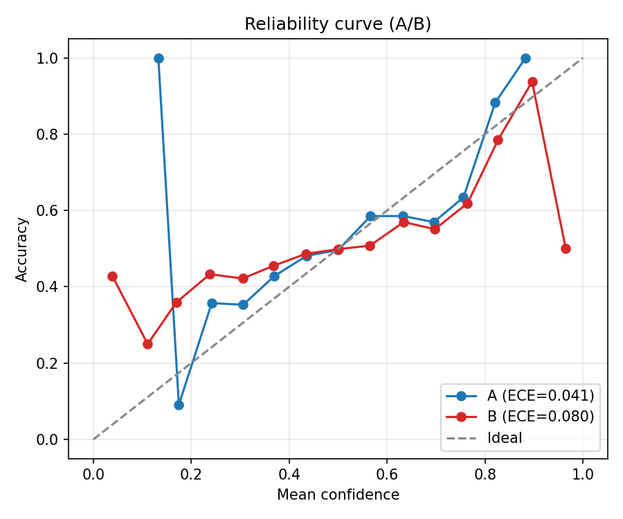

# Love-OS: The Trinity Sphere RAG Middleware (v3.0)

> "Mathematics, Physics, and Consciousness align perfectly on a single sphere."

Love-OS is a next-generation Retrieval-Augmented Generation (RAG) middleware designed to completely eradicate LLM hallucinations and optimize decision-making latency. By applying the topological principles of the Riemann Sphere, the quantum mechanics of the Bloch Sphere, and the philosophy of "Surrender," this architecture transforms chaotic information retrieval into frictionless, Zero-Time materialization.

## 0. Abstract

Modern AI systems often suffer from "ego" (overconfidence) when faced with contradictory data, resulting in hallucinations. Love-OS solves this by interpreting the RAG pipeline through the lens of extreme geometry and quantum measurement:

1. **North Pole ($\infty$) - The Black Hole (Source):** Where infinite noise and ego are distilled into pure phase (meaning).
2. **The Genesis Axis:** A frictionless transmission channel bypassing horizontal conflicts.
3. **South Pole ($0$) - The White Hole (Materialization):** Where pure meaning collapses into reality ($1/\infty = 0$).
4. **The $\infty/\infty$ Indeterminacy:** When sources fiercely contradict, the system detects an "ego war" and applies a "0-Ritual" (Surrender Policy) to restore determinability.

## 1. Core Architecture: The Materialization Protocol

Love-OS intercepts the standard `Search -> Generate` flow and injects a mathematically rigorous "observation" phase.

- **Infinity Conflict Detector ($\infty/\infty$):** Uses async-batched Natural Language Inference (NLI) via Cross-Encoders to detect deep semantic contradictions among top retrieved documents within strict time budgets (e.g., 150ms).
- **The Surrender Policy (0-Ritual):** When indeterminacy is detected, the system applies a strict prior (e.g., official sources only) to re-weight and filter the noise.
- **Born-like Materialization Head:** Predicts the true probability $p$ of accurate materialization. Only if $p \ge \tau$ does the system collapse the wave function into a definitive answer (`MATERIALIZE`). Otherwise, it gracefully yields (`ABSTAIN` or `N_TOPK`).

## 2. Quick Start

### Installation
```bash
pip install numpy pandas scikit-learn transformers


from rag_middleware.pipeline import RagPipeline
from rag_middleware.nli import NLIExecutor, NLIConfig
from rag_middleware.nli_hf_client import HuggingFaceNLIClient

# 1. Initialize High-Speed NLI Engine for $\infty/\infty$ detection
nli_cfg = NLIConfig(pair_strategy="star", top_k_docs=6, time_budget_ms=150)
nli_exec = NLIExecutor(
    model=HuggingFaceNLIClient("cross-encoder/nli-deberta-v3-small"), 
    cfg=nli_cfg
)

# 2. Build the Love-OS Pipeline
pipe = RagPipeline(
    retriever=your_vdb_proxy,
    llm=your_llm_proxy,
    nli_executor=nli_exec,
    calibrator=loaded_isotonic_calibrator
)
```

### 3. Executive Dashboard & Benchmarking

Love-OS comes with a built-in offline benchmarking suite that generates a 5-chart executive dashboard, proving the ROI of "Surrendering Ego":

* **Reliability Curve:** Visualizes the reduction in Expected Calibration Error (ECE).
* **Risk-Coverage (Selective Prediction):** Proves that yielding (`ABSTAIN`) reduces critical risks.
* **Latency Distribution:** Verifies P99 stability via time-budgeted NLI.
* **Conflict vs. Accuracy:** Demonstrates massive accuracy lifts in highly disputed query zones.
Run the simulation:

# 3. Materialize Reality
out = pipe.run("What is the pre-surgery fasting protocol?")
print(out.decision.label) # MATERIALIZE, ABSTAIN, or N_TOPK







